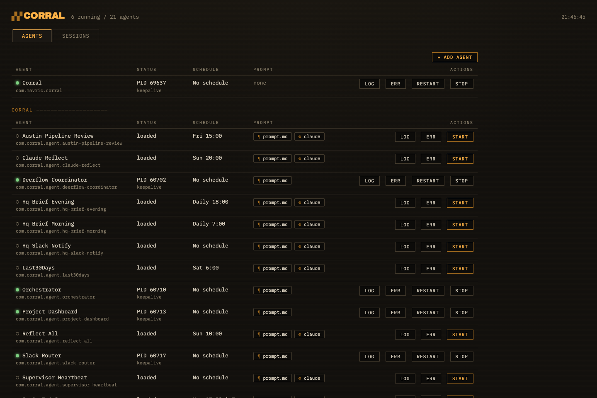
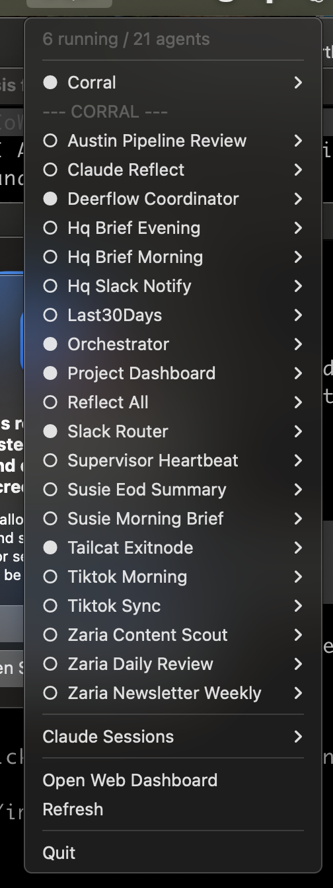

# Corral

Corral is a macOS menu bar app, local web dashboard, and CLI for running scheduled AI agents and recovering lost Claude Code sessions.

Corral does three things:

1. **Runs your agents.** Register an agent with a name, a prompt, a schedule, and an engine. Corral turns it into a launchd job that survives reboots, keeps per-run logs, and reports live status in your menu bar.
2. **Lets you manage agents anywhere.** Start, stop, and restart agents, edit their prompts, and switch the model they run on, from the menu bar or from a browser.
3. **Recovers lost Claude Code sessions.** When your laptop restarts and your terminal sessions die, Corral lists every recent session and reopens any of them in iTerm2 or Terminal, in the right directory, with one click.

<p align="center">
  
  
</p>

## How it works

- Each agent is a plain folder in `~/.config/corral/agents/<name>/` that holds its config, prompt, and logs. Corral generates one launchd job per agent from these folders.
- The menu bar app and the web dashboard read the same registry, so both always show the same state.
- Session recovery reads the transcripts Claude Code already writes to `~/.claude/projects/` and shells out to `claude --resume`. Corral never modifies them.

## Requirements

- macOS
- Python 3.10 or later (`brew install python`). The Xcode-bundled Python 3.9 also works; the installer pins pyobjc 11.x there because pyobjc 12 has no 3.9 wheels.
- [Claude Code](https://claude.com/claude-code) for the default agent engine and for session recovery
- Optional: iTerm2 (Corral falls back to Terminal), and any additional engines you plan to use: [Codex CLI](https://github.com/openai/codex), [Ollama](https://ollama.com), [Aider](https://aider.chat), or [DeepSeek Harness](https://github.com/deepseek-ai/deepseek-harness)

## Install Corral

### Option 1: one-line install

```bash
curl -fsSL https://raw.githubusercontent.com/cultron/corral/main/install-remote.sh | bash
```

The script installs Corral into `~/.corral` (override with `CORRAL_DIR`), creates a virtual environment, writes a default config to `~/.config/corral/config.json`, links the `corral` command onto your PATH, and sets Corral to start at login. Set `CORRAL_AUTOSTART=no` before the command to skip the start-at-login step. Rerunning the command updates an existing install.

**Note:** review [install-remote.sh](install-remote.sh) before piping it to your shell. It only writes to the install directory, `~/.config/corral/`, your PATH directory, and `~/Library/LaunchAgents/` (the macOS location for start-at-login items).

### Option 2: clone the repository

1. Clone and run the installer:

   ```bash
   git clone https://github.com/cultron/corral.git
   cd corral
   ./install.sh
   ```

2. When prompted, choose whether Corral should start at login. If you decline, start Corral manually:

   ```bash
   corral             # menu bar app and web dashboard
   corral --web-only  # dashboard only
   ```

### Verify the installation

```bash
corral agent list
```

The menu bar shows a text item such as `A 0/0`, and the dashboard is available at http://127.0.0.1:8765.

To uninstall, run the uninstall script. It removes the start-at-login item, stops and removes any agents registered with `corral agent add`, removes the `corral` link, and deletes the install directory and `~/.config/corral/` (pass `--keep-config` to keep your config and agents). Nothing else on the machine is touched:

```bash
~/.corral/uninstall.sh
```

Or without a local copy:

```bash
curl -fsSL https://raw.githubusercontent.com/cultron/corral/main/uninstall.sh | bash
```

## Quick start

Register an agent that runs every morning at 8:00:

```bash
echo "Summarize the files in ~/notes changed yesterday." > /tmp/prompt.md
corral agent add morning-digest --prompt /tmp/prompt.md --at 08:00
```

Corral writes the agent folder, installs its launchd job, and starts it on schedule. Run it once now and read the log:

```bash
corral run morning-digest
ls ~/.config/corral/agents/morning-digest/logs/
```

Open the dashboard at http://127.0.0.1:8765 to see the agent's status, edit its prompt inline, or change its engine.

## The agents folder

Every registered agent lives in `~/.config/corral/agents/<name>/`:

```
~/.config/corral/agents/
  morning-digest/
    agent.json    # engine, model, schedule, command, workdir, env
    prompt.md     # the prompt passed to the engine
    logs/         # one log file per run
```

This folder is the source of truth. `corral agent sync` reads it and generates one launchd job per agent, labeled `com.corral.agent.<name>`. Because agents are plain folders, you can back them up, commit them to a dotfiles repository, or copy them to another machine and run `corral agent sync` there.

Prompt edits take effect on the agent's next run. Edits to `agent.json` schedule or launchd keys require `corral agent sync`; engine and model edits do not.

## CLI reference

| Command | Description |
|---|---|
| `corral` | Start the menu bar app and web dashboard |
| `corral --web-only` | Start the dashboard without the menu bar app |
| `corral agent add NAME [flags]` | Register an agent and install its launchd job |
| `corral agent list` | List registered agents and their schedules |
| `corral agent remove NAME [--purge]` | Unload an agent; `--purge` also deletes its folder |
| `corral agent sync` | Regenerate launchd jobs from the agents folder |
| `corral run NAME` | Run an agent once and log the output |

Flags for `corral agent add`:

| Flag | Description |
|---|---|
| `--prompt FILE` / `--prompt-text TEXT` | The agent's prompt |
| `--at HH:MM` | Run daily at a time |
| `--weekday DAY` | Restrict `--at` to one weekday |
| `--every SECONDS` | Run on a fixed interval |
| `--keep-alive` | Run continuously; launchd restarts it on exit |
| `--engine NAME` | Harness to run on; defaults to `claude` |
| `--model NAME` | Model passed to the engine |
| `--command "..."` | Override the engine template entirely |
| `--workdir DIR` | Working directory for runs |
| `--env K=V` | Environment variable; repeatable |
| `--extra JSON` | Raw launchd keys merged into the job |

An agent with no schedule flags is manual: it runs only through `corral run NAME`.

## Engines and models

An engine is the harness that drives a model. Corral ships five: `claude` (default), `codex`, `ollama`, `aider`, and `dsh` (DeepSeek Harness). Set the engine and model per agent:

```bash
corral agent add summarizer --prompt ./prompt.md --at 07:30 \
  --engine ollama --model qwen3-coder:30b
```

To change an agent's engine later, click the gear chip on its row in the dashboard, or edit `engine` and `model` in its `agent.json`. Scheduled agents use the new choice on their next run. Keep-alive services restart immediately.

Add your own engines in the config's `engines` table. `{model_args}` expands when the agent has a model and disappears otherwise:

```json
"engines": {
  "my-harness": {
    "command": ["my-agent-cli", "run", "{model_args}", "{prompt}"],
    "model_args": ["--model", "{model}"]
  }
}
```

Agents that run through a wrapper script receive `CORRAL_ENGINE`, `CORRAL_MODEL`, and `CORRAL_AGENT` as environment variables, so the wrapper can route to the right harness itself.

**Caution:** engines differ in capability, not just in model quality. `claude`, `codex`, and `dsh` are agentic: they can read files and use tools. `ollama` is text in, text out. An agent whose prompt requires reading real data (calendars, email, files) produces fabricated output on a text-only engine.

## Services and advanced launchd options

Agents can be long-running services. `--keep-alive` agents are exec'd directly, so launchd supervises the real process and stop or restart signals reach it. For launchd keys the CLI does not model, pass raw JSON with `--extra`:

```bash
# a watcher triggered when a file changes
corral agent add inbox-alert --command "bash ~/scripts/notify.sh" \
  --extra '{"WatchPaths": ["/Users/me/inbox/ALERT.md"], "ThrottleInterval": 60}'

# a server restarted only on crash, not on clean exit
corral agent add api-server --command "node ~/api/server.js" \
  --extra '{"KeepAlive": {"SuccessfulExit": false}, "RunAtLoad": true}'
```

`corral agent sync` reloads only the agents whose generated job changed, so adding one agent never restarts your running services.

## Web dashboard

The dashboard runs at http://127.0.0.1:8765 and has two views:

- **Agents**: every agent grouped by name, with status, schedule, prompt chips that expand into an inline editor, engine chips, log viewers, and start, stop, and restart controls. The **Add Agent** button registers a new agent without touching the terminal.
- **Sessions**: recent Claude Code sessions across all projects, with a resume button and a copy-command button for each.

The dashboard can also show LaunchAgents that Corral does not manage. Add glob patterns to `launchagent_patterns` in the config to include them.

## Claude Code plugin

This repository is also a Claude Code plugin marketplace. After you install the plugin, Claude can register agents for you from a conversation, for example "add an agent that summarizes my inbox every morning at 8":

```
/plugin marketplace add cultron/corral
/plugin install corral@corral
```

To use the skill without the plugin, copy it into your skills directory:

```bash
mkdir -p ~/.claude/skills
cp -R plugin/skills/corral-agents ~/.claude/skills/
```

## Session recovery

Claude Code writes each session transcript to `~/.claude/projects/<project>/<session-id>.jsonl`. Corral reads the head of each transcript to recover the working directory and the opening prompt, then opens a terminal window running:

```bash
cd <project directory> && claude --resume <session-id>
```

Corral only reads these files. The resumable window matches Claude Code's own `cleanupPeriodDays` retention setting.

## Configuration reference

Corral reads `~/.config/corral/config.json`. Every key is optional.

| Key | Default | Description |
|---|---|---|
| `launchagent_patterns` | `[]` | Glob patterns for extra LaunchAgents to show. Corral-registered agents always appear. An empty list shows all non-Apple agents. |
| `prompt_dirs` | `[]` | Extra directories scanned for editable prompt files. The agents folder is always included. |
| `claude_projects_dir` | `~/.claude/projects` | Where Claude Code stores session transcripts. |
| `web_host` | `127.0.0.1` | Dashboard bind address. Keep it on localhost. |
| `web_port` | `8765` | Dashboard port. |
| `terminal` | `auto` | `auto`, `iterm`, or `terminal`. Auto picks iTerm2 when installed. |
| `menu_sessions` | `12` | Sessions shown in the menu bar dropdown. |
| `menu_title` | `""` | Text shown between the corral icon and the running/total count. |
| `engines` | built-ins | Engine table; your entries extend the built-ins. |

## Security

The web server binds to 127.0.0.1 and must stay there. Its API can start launchd jobs, open terminal windows, and edit files inside your prompt directories, so do not expose the port on a network. File editing is restricted to discovered prompt files; requests for other paths are rejected.

## Roadmap

Planned work lives in [ROADMAP.md](ROADMAP.md). Highlights:

- An agent installation system (`corral agent install <repo>`) for sharing packaged agents
- Session recovery for engines beyond Claude Code (Codex, DeepSeek Harness)
- A guided DeepSeek Harness setup, including its MCP tool bridge
- Engine health checks surfaced in the dashboard

Contributions are welcome. Open an issue to discuss a roadmap item before starting a large change.

## License

MIT. See [LICENSE](LICENSE).
